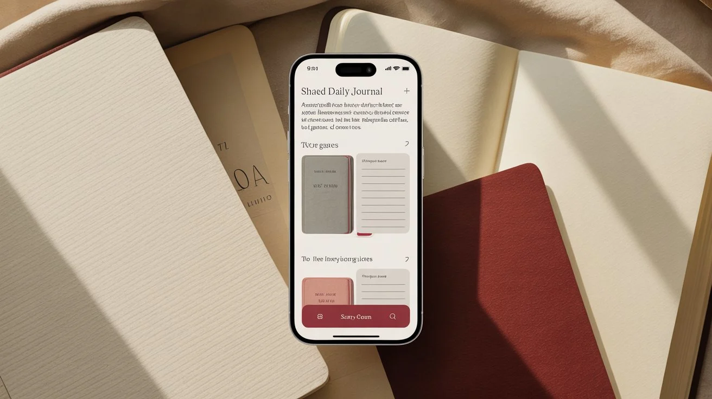

<h1 align="center">
  <br>
  C-Aleena
  <br>
  <br>
</h1>

<h4 align="center">A beautifully crafted, intimate shared calendar experience for couples.</h4>

<p align="center">
  
</p>

<br>

## Overview

**C-Aleena** is a premium, minimalist shared calendar application designed specifically for couples. It moves away from the utilitarian feel of traditional calendar apps and introduces a warm, journal-like aesthetic. It serves not just as a scheduling tool, but as a shared space for moments, notes, and milestones.

Built with modern web technologies, C-Aleena offers real-time synchronization, seamless authentication, and a beautifully fluid user interface.

## Features

- **Intimate Design:** A journal-like aesthetic with soft glowing dates, curated typography, and ambient animations to create a premium feel.
- **Real-Time Synchronization:** Instant updates across devices using Convex, ensuring both partners are always in sync.
- **Shared Memories & Notes:** Add notes, memories, or plans to specific dates, visible instantly to your partner.
- **Secure & Private:** Partner connection is handled via secure, expiring invite tokens.
- **Responsive & Fluid:** Beautifully rendered on all devices, with rich micro-interactions powered by Framer Motion.

## Tech Stack

C-Aleena is built entirely on a modern, high-performance stack:

- **Framework:** [Next.js 15](https://nextjs.org/) (App Router)
- **UI Library:** [React 19](https://react.dev/)
- **Styling:** [Tailwind CSS v4](https://tailwindcss.com/)
- **Animations:** [Framer Motion](https://www.framer.com/motion/)
- **Backend & Database:** [Convex](https://www.convex.dev/) (Real-time backend as a service)
- **Authentication:** [Clerk](https://clerk.com/)
- **Language:** [TypeScript](https://www.typescriptlang.org/)

## Getting Started

### Prerequisites

Ensure you have [Node.js](https://nodejs.org/) installed along with your preferred package manager (npm, pnpm, or yarn). You will also need accounts with **Clerk** (for auth) and **Convex** (for backend).

### Installation

1. **Clone the repository**

   ```bash
   git clone https://github.com/Rahul-Sahani04/c-aleena.git
   cd c-aleena
   ```

2. **Install dependencies**

   ```bash
   npm install
   # or yarn / pnpm install
   ```

3. **Environment Setup**

   Create a `.env.local` file in the root directory and add your Clerk and Convex keys:

   ```env
   NEXT_PUBLIC_CLERK_PUBLISHABLE_KEY=your_clerk_publishable_key
   CLERK_SECRET_KEY=your_clerk_secret_key
   
   CONVEX_DEPLOYMENT=your_convex_deployment
   NEXT_PUBLIC_CONVEX_URL=your_convex_url
   ```

4. **Initialize Convex Backend**

   Run Convex in development mode to push your schema and start the real-time backend:

   ```bash
   npx convex dev
   ```

5. **Start the Development Server**

   In a new terminal window, start the Next.js development server:

   ```bash
   npm run dev
   ```

   The app will be available at `http://localhost:3000`.

## Architecture & Database

The backend is completely serverless and real-time, managed by Convex. 

### Core Schema

- **`calendars`**: Tracks the shared calendar instance, its owner, the partner's name, and invitation constraints.
- **`participants`**: Links users to a specific calendar space.
- **`notes`**: Stores individual dated entries, memories, or plans shared between the couple.

All operations strictly enforce authentication via Clerk, and Convex resolvers ensure that only verified participants can read or modify calendar data.

## Contributing

While C-Aleena is built as a personal project, suggestions and feedback are always welcome. Feel free to open an issue or submit a pull request if you notice any bugs or have ideas for improvement.

## License

This project is licensed under the MIT License.
